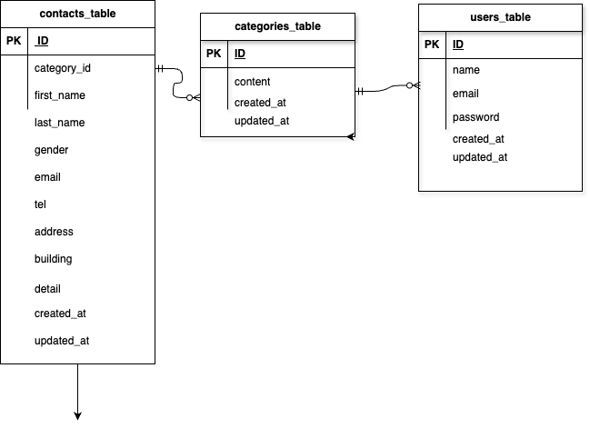

## アプリケーション名

お問い合わせファーム

## 環境構築

```
リポジトリからダウンロード
git clone git@github.com:ozawa038/ozawa-kadai1.git
src ディレクトリにある「.env.example」をコピーして 「.env」を作成し DB の設定を変更
cp .env.example .env

DB_CONNECTION=mysql
DB_HOST=mysql
DB_PORT=3306
DB_DATABASE=laravel_db
DB_USERNAME=laravel_user
DB_PASSWORD=laravel_pass

docker コンテナを構築
docker-compose up -d --build

Laravel をインストール
docker-compose exec php bash
composer install

アプリケーションキーを作成
php artisan key:generate

DB のテーブルを作成
php artisan migrate

DB のテーブルにダミーデータを投入
php artisan db:seed

"The stream or file could not be opened"エラーが発生した場合
src ディレクトリにある storage ディレクトリに権限を設定
chmod -R 777 storage
```

## 使用技術(実行環境)

・php8.0
・mysql  Ver 8.0.26
・Laravel Framework 8.83.8
・nginx version: nginx/1.21.1
## URL

```
アプリページ：http://localhost/
phpMyAdmin：http://localhost:8080/
```

## ER 図


